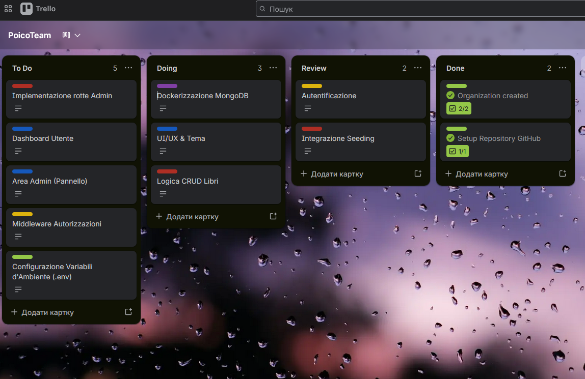

# 📚 BooksClub — Personal Library Management System

BooksClub è un'applicazione web full-stack che permette agli utenti di creare e gestire la propria libreria personale digitale.

Ogni utente dispone di un catalogo privato in cui può organizzare i propri libri, monitorarne lo stato di lettura, aggiungere recensioni e gestire i preferiti. Il sistema integra autenticazione sicura, gestione dei ruoli e un'interfaccia moderna sviluppata con Angular.

Il progetto è stato realizzato utilizzando un'architettura client-server composta da un frontend Angular, un backend RESTful in PHP (Slim Framework) e un database MongoDB containerizzato tramite Docker.

---

## ✨ Funzionalità Principali

### 🔐 Autenticazione e Sicurezza

* Registrazione nuovi utenti
* Login e Logout
* Gestione sessioni tramite cookie PHP (`PHPSESSID`)
* Verifica automatica della sessione attiva
* Protezione delle rotte riservate
* Controllo accessi basato sui ruoli

### 👥 Gestione Ruoli

#### User

* Accesso alla propria libreria personale
* Creazione, modifica ed eliminazione dei libri
* Gestione preferiti
* Aggiornamento dello stato di lettura
* Inserimento recensioni personali

#### Admin

* Accesso all'area amministrativa
* Gestione utenti registrati
* Supervisione del sistema

### 📚 Gestione Catalogo

Ogni libro può contenere:

* Titolo
* Autore
* Stato di lettura
* Recensione
* Copertina (tramite URL)
* Flag preferito

Operazioni disponibili:

* Creazione libro
* Visualizzazione catalogo
* Modifica libro
* Eliminazione libro

### 🎨 Esperienza Utente

* Tema Dark / Light
* Toast di notifica
* Gestione errori centralizzata
* Dashboard dinamica
* Aggiornamento automatico dei dati dopo ogni operazione
* Paginazione del catalogo

---

## Stato del Progetto
Ecco come è stata organizzata la pianificazione dello sviluppo:



---

## 🏗️ Architettura

```text
┌─────────────────┐      HTTP + Cookies      ┌──────────────────┐
│    FrontEnd     │ ───────────────────────► │     BackEnd      │
│ Angular :4200   │      /api tramite proxy  │ PHP Slim :8080   │
└─────────────────┘                          └────────┬─────────┘
                                                      │
                                                      ▼
                                             ┌─────────────────┐
                                             │    MongoDB      │
                                             │   Container     │
                                             └─────────────────┘
```

L'applicazione segue una chiara separazione tra:

| Modulo   | Tecnologia | Descrizione      |
| -------- | ---------- | ---------------- |
| FrontEnd | Angular    | Interfaccia SPA  |
| BackEnd  | PHP + Slim | API RESTful      |
| Database | MongoDB    | Persistenza dati |

---

## 📁 Struttura del Progetto

```text
BooksClub/
│
├── FrontEnd/
│   ├── src/
│   ├── public/
│   └── README.md
│
├── BackEnd/
│   ├── src/
│   ├── public/
│   └── README.md
├── docs/
├── docker-compose.yml
└── README.md
```

Per maggiori dettagli sui singoli moduli:

* `FrontEnd/README.md`
* `BackEnd/README.md`

---

## 🚀 Avvio Rapido

### Prerequisiti

* Docker
* Docker Compose

---

### 1. Clonazione del Repository

```bash
git clone <repository-url>
cd BooksClub
```

---

### 2. Avvio dell'Ambiente

```bash
docker compose up --build
```

oppure:

```bash
docker-compose up --build
```

Docker si occuperà di inizializzare:

* Backend PHP
* Database MongoDB
* Configurazioni necessarie al funzionamento del sistema

---

### 3. Avvio del Frontend

```bash
cd FrontEnd
npm install
npm start
```

---

## 🌐 Servizi Disponibili

| Servizio         | URL                       |
| ---------------- | ------------------------- |
| Frontend Angular | http://localhost:4200     |
| API REST         | http://localhost:4200/api |
| MongoDB          | Gestito tramite Docker    |

---

## 🔄 Flusso Applicativo

1. Registrazione di un nuovo account
2. Login utente
3. Accesso alla dashboard personale
4. Inserimento di nuovi libri
5. Modifica o eliminazione dei libri esistenti
6. Aggiornamento automatico della dashboard e delle statistiche

Gli amministratori possono inoltre accedere all'area:

```text
/admin
```

per la gestione degli utenti.

---

## 👨‍💼 Account Amministratore Predefinito

All'avvio del backend viene eseguito automaticamente un processo di seeding che crea un account amministratore, se non già presente.

| Username | Password   |
| -------- | ---------- |
| admin    | Admin@1234 |

Accesso:

```text
http://localhost:4200/login
```

La registrazione pubblica genera esclusivamente utenti standard.

---

## 🔒 Sicurezza

BooksClub implementa diverse misure di sicurezza:

* Sessioni PHP lato server
* Cookie di autenticazione
* Protezione delle API tramite sessione attiva
* Separazione dati per utente
* Middleware per controllo dei ruoli
* Rotte amministrative protette
* Restrizioni CORS configurate sul backend

Ogni utente può accedere esclusivamente ai propri libri tramite il controllo dell'identificativo utente associato alle risorse.

---

## 🛠️ Stack Tecnologico

### Frontend

* Angular
* TypeScript
* RxJS
* Tailwind CSS

### Backend

* PHP
* Slim Framework
* PHP-DI
* Composer

### Database

* MongoDB

### DevOps

* Docker
* Docker Compose

---

## 📈 Roadmap

Funzionalità pianificate per le future versioni:

* Ricerca avanzata
* Filtri per autore e stato di lettura
* Ordinamento personalizzato
* Upload diretto delle copertine
* Dashboard statistiche avanzate
* Test automatici
* Documentazione API tramite Swagger/OpenAPI

---

## 📄 Licenza

Progetto sviluppato a scopo didattico e formativo per approfondire lo sviluppo di applicazioni full-stack moderne basate su Angular, PHP e MongoDB.

---

### 👨‍💻 Autore

BooksClub rappresenta un progetto completo di gestione libraria che integra frontend moderno, API RESTful e database NoSQL all'interno di un ambiente Dockerizzato, con particolare attenzione a modularità, sicurezza e manutenibilità del codice.
